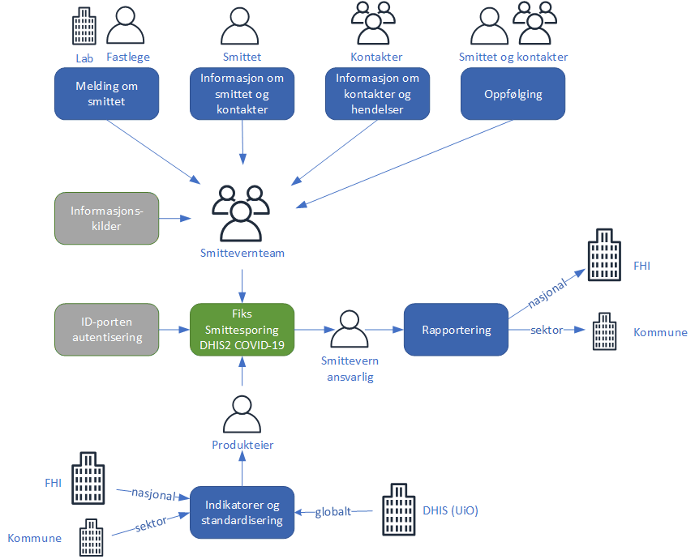

# Kort beskrivelse
Fiks smittesporing er et vektøy ment brukt for å holde oversikt over Covid-19 smitten i samfunnet gjennom registrering av smitte og nærtkontakter. 

# Tilgjengelige grensesnitt
| Grensesnitt | Støtte |
|------|------|
| Web portal | Ja |
| Maskin til maskin | Nei |

# Beskrivelse
KS skal levere en digital tjeneste for smittesporing til bruk i landets kommuner. I dag foregår manuell smittesporing i de fleste kommuner, ved hjelp av telefon og papir. Noen kommunner har opprettet enkle excel-baserte databaser. Smittesporing utføres av ansatte (lege, kommunelege, andre ansatte) i kommunene som intervjuer den som er smittet og etterpå personer den smittede har vært i kontakt med, og det settes i gang tiltak for å følge opp disse personene. Denne informasjonen ønskes nå innsamlet gjennom DHIS2, slik at kommunen skal kunne få hjelp til å identifisere og systematisere tilfeller og deres kontakter, og danne seg en oversikt over hvor smitte foregår i samfunnet for rapportering til FHI og for iverksetting av målrettede smitteverntiltak.

Løsningen er basert på systemet DHIS2 som har en egen modul for behandling av covid-19. Når det i dokumentet står DHIS2 menes covid-19 modulen. Data bygges opp manuelt i systemet eller ved excel-import. ID-porten blir benyttet for autentisering. Det er ingen grensesnitt til andre systemer.

Systemet har en felles installasjon for alle kommunene og leveres som en skytjeneste. Dette gir en felles forståelse av informasjonen i systemet og effektiviserer rapporteringen i kommunene og til FHI. Rapportering om smittesporing fra kommunene er et viktig verktøy for å vurdere nasjonale smittereduserende tiltak og effekten av disse. En felles skytjeneste forenkler det å ta i bruk løsningen og nye versjoner.

Figuren under beskriver de overordnede prosessene som inngår i tjenesten Smittsporing.

Funksjonaliteten i DHIS2 er kort fortalt registrering av informasjon om smittet og hvem den smittede har vært i nærkontakt med, innsamlet gjennom intervju. Nærkontakter er definert av FHI som personer som har hatt tett kontakt med en person som er bekreftet syk med covid-19 fra 48 timer før symptomdebut og til personen er avisolert. Disse er etter covid-19 forskriften pålagt å være i karantene. De som har nærmest kontakt, har størst risiko for å være smittet. Ved sannsynlig, men ikke bekreftet covid-19, anbefales det at husstandsmedlemmer eller tilsvarende nære kontakter oppholder seg i karantene. Gjeldende definsjon og retningslinjer for smittetifeller og nærkontakter finnes på FHI sine nettsider. https://www.fhi.no/nettpub/coronavirus/helsepersonell/definisjoner-av-mistenkte-og-bekreftede-tilfeller-med-koronavirus-coronavir/

Smittet og nærkontakter samles i et felles personregister slik at en unngår dobbeltregistrering. Ved innsamling av informasjon kan ansatte bruke andre kilder som folkeregisteret, karttjenester, arrangementinformasjon, etc.

I tillegg til smittet og nærkontakter kan det registreres hendelser som er en samling av mange personer, hvor smittet og nærkontakter har deltatt. Eksempler på hendelser kan være konserter, samlinger, sykehjem, barnehage, etc.

Smittet og nærkontakter følges opp med tiltak og oppfølging parallelt med rapportering til kommunene og FHI.

Konfigurasjonen av DHIS2 covid-19 for kommunene består av skjema og indikatorer utarbeides i samarbeid mellom kommunene og FHI. Produkteier i KS koordinerer dette arbeidet.

## Organisasjon
DHIS2 er et fellessystem hvor øverste organisasjonsenhet er Norge. Landet er videre delt opp i fylkeskommuner og kommuner. På denne måten kan det lages rapporter pr. kommune som aggregeres opp til en nasjonal oversikt. Dette er en viktig egenskap ved tjenesten da oppfølging og ansvar for covid-19 smitte og -tiltak ligges hos FHI.

Register over Kommuner og fylkeskommuner er registert med kommunenummer i henhold til Kartverkets kommuneregister. Dette kan ikke endres, men det kan legges til organisatoriske enheter innenfor hver kommune. Dette kan være bydel som de største kommunene benytter.

## Brukeradministrasjon og tilgangsstyring
DHIS2 er en skytjeneste hvor tilgang (auturisasjon) gis på kommunenivå. 

Autentisering av brukere skjer ved bruk av ID-porten.

Når en kommune ønsker å ta i bruk DHIS2 må de ha en signert avtale om bruk av Fiks-plattformen med et tjenestevedlegg om bruk av DHIS2. Administrator i kommunen får da tilgang til løsningen og kan registrere flere brukere i sin kommune.
Standard roller er definert som:

Rolle | Beskrivelse | Tilgang 
----- | ----------- | -------
Administrator | Administrerer brukere og tilganger til systemet | Administrasjon av brukere og gi tilgang til systemet I egen kommune
Kommunebruker | Se og registrere opplysninger | Alt innenfor egen kommune utover å gi nye brukere tilgang

Registrering av roller skjer i Fiks-konfigurasjon. Administrator på Fiks-plattformen opprettes når det inngås avtale mellom kommune og KS om bruk av Fiks-plattformen.

## Skjema og indikatorer
DHIS2 er en generisk løsning hvor hvilken informasjon og regler løsningen skal inneholde settes opp i en konfigurasjon. Registrering av disse opplysningene (metadata) og skjema for registrering av løsningen gjøres sentralt av Fiks forvaltning. 

Tilpasninger til den enkelte kommune er ikke mulig.
Behov meldes inn til produktansvarlig i KS og vurderes tatt med i DHIS2 ved senere versjoner.

## Rapportering til FHI
Det er en forutsetning at nødvendig data for den nasjonale oversikten av smittespredning i sammfunnet samles inn og rapporteres på en enkel og betimellig måte. For å kunne vurdere effekten av de iverksatte smitteverntiltakene og evaluere hvordan endringer av tiltakene påvirker smittespredningen i samfunnet er det ønskelig at kommunen innhenter og rapporterer ukentlige aggregerte data til FHI om:

i. antall tilfeller og nærkontakter 
ii.	antall og andel påviste covid-19 tilfeller med kjent eksponering til nærkontakt fordelt etter eksponeringssted: husstand, barnehage, skole (1.-12. trinn), universitet eller høyskole, arbeidsplass, helseinstitusjon (sykehjem, aldershjem, rehabilitering, sykehus etc.), arrangement, organisert fritidsaktivitet, reise, ukjent
iii.	antall og andel covid-19 tilfeller etter kjent eksponering til en felles smittekilde (utbrudd) fordelt på smittested

## Import fra registrerte opplysninger i excel
Det er utviklet et excel regneark som kan benyttes ved import av registrerte smittede og nærkontakter før DHIS2 tas i bruk. Data fra kommunen må da registreres i regnearket og sendes til Fiks for opplasting i databasen. I første omgang gjøres dette i testdatabasen med anonymiserte data for å verifisere at opplastning gir forventet resultat.

Tidligere smittesporing kan også registreres tilbake i tid direkte i DHIS2. Det vil være en fordel for oversikten av utviklingen av epiemien i Norge over tid å få samlet tidligere smittesporingsdata fra kommunene i DHIS2.

# Sikkerhet
Ivaretakelse av digital sikkerhet i nasjonale felleskomponenter og andre samfunnskritiske systemer som leveres av virksomheter i offentlig sektor, må ha et særskilt fokus. Med økt fokus på innebygget personvern og informasjonssikkerhet blir Fiks-plattformen stadig bedre sikret, og er i seg selv å anse som et godt sikringstiltak for kommunal sektor.

KS Fiks har utarbeidet en påbegynt mal for risikovurdering av hele verdikjeden, dvs. fra kommunens forretningskritiske prosesser til innbyggeren. Målet med risikovurderingen er å sette den digitale fellestjenestene inn i rett kommunal kontekst. 

På samme måte har KS også påbegynt en vurdering av personvernkonsekvenser (DPIA) ved bruk av tjenesten, som kommunene kan velge å benytte.

Den enkelte digitale fellestjeneste avtalefestes ved et eget tjenestevedlegg til den grunnleggende avtalen om tilknytning og bruk av Fiks-plattformen.

## Bruken av DHIS2
Det er viktig å påpeke at hver enkelt kommune selv må ta eierskap til de overnevnte dokumentene KS, som databehandler, utarbeider. Kommunen må se sikringen i egne prosesser og gjøre evt. endringer som er aktuelle for sin kommune før de går god for gjenværende risiko og tar denne tjenesten i bruk.

Kommunene er selv ansvarlig for brukerforvaltning, som å legge til nye brukere, endre roller og sletting av brukere. Dette inngår som en naturlig del av de organisatoriske tiltakene kommunen selv må ta ansvar for og følge opp.

## Klassifisering av informasjon
DHIS2 inneholder mye personopplysninger, og en del særlige kategorier av personopplysninger. Dette betyr at det stilles høye krav til sikring av informasjon med hensyn til å ivareta de registrertes rettigheter og friheter. Jf. det tidligere nevnte DPIA-dokumentet.

## Teknologiske sikringstiltak
Digdirs fellestjenester ID-porten og maskinporten benyttes til autentisering, og benyttes som identitetsbærer i hele Fiks-plattformen. ID- og maskinporten-tokens benyttes også som grunnlag for plattformens gjennom-gående autorisasjonslag, som benyttes på tvers av alle tjenester.  Gjennom faste prinsipper og komponenter oppnår plattformen er veletablert og godt testet funksjonalitet for autentisering og autorisasjon.

Data i bevegelse skal i Fiks-plattformen beskyttes med kryptering (TLS/SSL) og skal også være kryptert . Alle vesentlige operasjoner i Fiks-plattformen skal være sporbare og logges til en tilgangs-beskyttet sikkerhetslogg (audit log).

Utvikling av Fiks-plattformen følger prinsippene for innebygget personvern med grunnleggende opplæring i personvern og informasjonssikkerhet, avdekking av krav til personvern og informasjonssikkerhet ved systematisk arbeid med DPIA og ROS, sikker design vha. trusselmodellering og STRIDE, sikker koding med bruk av statisk kodeanalyse, automatisk oppdatering av sårbare avhengigheter, sikkerhetstesting på flere nivåer med enhetstesting, integrasjonstesting og akseptansetesting samt automatisert bygging og produksjonssetting som kun gjennomføres etter at tester og kvalitetskriterier er oppfylt.

## Drift av Fiks-plattformen
Alle tjenester i Fiks-plattformen går gjennom både ingressfiltrering, WAF (web application firewall) og overvåkes av operative sikkerhetssentre i flere lag. Datasentrene Fiks-plattformen kjører på er begge ISO27001-sertifisert og det blir gjennomført årlige revisjoner av informasjonssikkerhet og personvern. Revisjonene blir gjennomført av tredjeparts revisorer etter revisjonsstandardene ISAE-3402 og ISAE-3000. Driftsmiljøet overvåkes av driftsleverandørens eget sikkerhetsoperasjonssenter og NorCERT.

## Testmiljø
All utvikling av Fiks-plattformen foregår i et eget test- og utviklingsnett (heretter testmiljøet). Testmiljøet skal ikke inneholde reelle personopplysninger. Data skal ikke overføres mellom test- og produksjonsmiljø. I testmiljøet skal det kun benyttes anonymiserte, avidentifiserte eller samtykkebaserte data. Alle endringer kjøres først ut i test- og utviklingsmiljøet, før det settes i produksjon. I testmiljøet kjøres blant annet akseptansetest før en vesentlig endring går i produksjon. Testmiljøet er også benyttet i forbindeles med tilgjengeliggjøring av og integrasjon mellom Fiks-plattformen og DHIS2 covid-19.

# Avhengigheter
## Fiks-plattformen
Forutsetning for ta i bruk DHIS2 er at det finnes en SSA-L avtalen mellom KS og kommunen om bruk av Fiks-plattformen i kommunen. Det er en egen avtale for bruk av DHIS2 med covid-19 modul som er et tjenestevedlegg til SSA-L. Tjenestevedlegget inneholder databehandleravtale mm.
Når avtaler er på plass setter kommunen selv opp tilgang til løsningen ved at administrator registrere brukere med roller.

# Bruk av standarder
## Begreper
Term | Beskrivelse
---- | -----------
Testing | Prosessen med å diagnostisere covid-19 med påvisning av viruset eller antistoff mot SARS-CoV-2 i en kroppsvæske. Består av tre hovedledd: Prøvetaking, analyse og besvarelse
Prøvetaking | Taking av prøve fra biologisk materiale hos en person
Analyse | Forsøk på å påvise arvestoff fra SARS-CoV-2 eller antistoffer mot SARS-CoV-2 i en prøve fra en person
Smitteoppsporing (kontaktsporing, smittesporing) | Prosessen med å finne, informere og eventuelt følge opp eller teste smittekontakter
Indekspasient | En person som får positiv test og som dermed utløser en smitteoppsporing
Smittekontakter (nærkontakter) | Personer som har opplevd en smittefarlig hendelse med indekspasienten, altså den type interaksjon som var nær, varte lenge og skjedde i indekspasientens smittsomme periode slik at smitte kan ha skjedd
Smittekilde | Den smittekontakten som smittet indekspasienten
Sekundærkontakter | De smittekontakter som er blitt smittet av indekspasienten
Smittefarlig hendelse | En type interaksjon som var nær, varte lenge og skjedde i indekspasientens smittsomme periode slik at smitte kan ha skjedd

#	Avgrensning
## Felles kommunal løsning
Tjenesten er en felles kommunal løsning som settes opp likt for alle kommuner. Dette gjør at løsning hurtig blir tilgjengelig for kommunene og nye versjoner kan raskt gjøres tilgjengelig.

## Nasjonale felleskomponenter
Id-porten benyttes for autentisering av personer som bruker løsningen.

#	Kompetanse
FHI ønsker å veilede og bidra til å forbedre kompentase til helsetjenesten om smittesporingsarbeid og vurderinger rundt karanteneperioder. I den sammenheng er FHI i ferd med å utvikle et opplæringseminar for smittesporingspersonale i kommunene, som er tilpasset de praktiske og faktiske forholdene rundt covid-19, koronavirus.

## Kunnskap om koronavirus og smittesporing
Det er viktig at de som arbeider med smittesporing, hurtig kan sette seg inn i intervjurollen og har basiskunnskap om covid-19 da personer som kontaktes gjerne har spørsmål. I den sammenheng har FHI utviket en koronaveilder som er tilgjengelig på FHI sine nettsider: https://www.fhi.no/nettpub/coronavirus/ 

## Kunnskap om systemet DHIS2-covid-19
KS arbeider med en veileder for brukere av systemet.

Alle kurs vil gjøres tilgjengelig på KS-læring.

# Referanser
1. Bestilling av tilgang til Fiks smittesporing: smittesporing@ks.no 
3. Informasjon om DHIS2 Covid-19: https://www.dhis2.org/covid-19 
4. Coronaveileder https://www.fhi.no/nettpub/coronavirus/ 
5. Kontaktsporing og oppfølging av kontakter til personer med nytt koronavirus (coronavirus)
https://www.fhi.no/nettpub/coronavirus/helsepersonell/definisjoner-av-mistenkte-og-bekreftede-tilfeller-med-koronavirus-coronavir/?term=&h=1
6. Hjemmekarantene og hjemmeisolering - råd til helsepersonell https://www.fhi.no/nettpub/coronavirus/helsepersonell/hjemmekarantene-og-hjemmeisolering-i-forbindelse-med-covid-19/?term=&h=1

