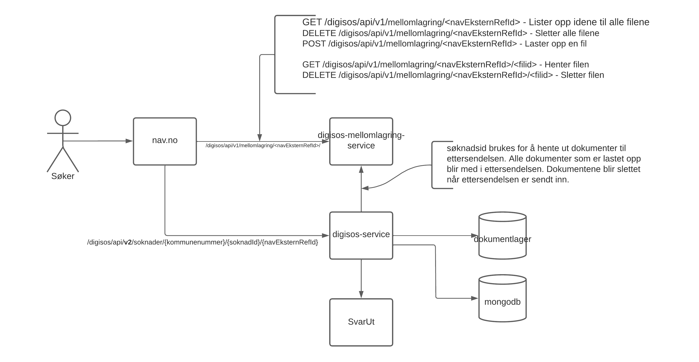

## Kort beskrivelse
Fiks Digisos er en tjeneste for å tilrettelegge for kommunal behandling av sosialsøknader via et brukergrensesnitt på [nav.no](https://www.nav.no).

Fiks Digisos tilbyr:

* Enkelt oppsett for den enkelte kommune gjennom Fiks Konfigurasjon.
* Innbygger får fortløpende oppdatering på saksgang, tilgjengelig på [nav.no](https://www.nav.no).
* Innbygger får tilgang til alle dokumenter og mulighet til å sende inn nye søknader basert på data fra tidligere søknader.
* Ansatte/brukerstøtte i NAV kan se utvalgte deler av saken via NAV sine systemer.

## Tilgjengelige grensesnitt
| Grensesnitt | Støtte |
|------|------|
| Web portal | Ja |
| Maskin til maskin | [api-spec](https://editor.swagger.io/?url=https://developers.fiks.ks.no/api/digisos-sak-api-v1.json)|


## Beskrivelse av tjenesten
  
For at fagsystemet skal få tilgang til å motta sosialsøknader og sende saksoppdateringer til NAV via Digisos-API-et for en kommune, må kommunen først konfigurere og aktivere tjenesten Digisos gjennom [Fiks Konfigurasjon](https://forvaltning.fiks.ks.no/fiks-konfigurasjon/tjenester), som viser en veiviser for å sette opp tjenesten. Her konfigurerer man opp hvordan kommunens fagsystem skal motta søknader, enten via Fiks IO (anbefalt kanal) og/eller SvarUt. Det må også oppgis kontaktpersoner med minst èn epost for både en fagansvarlig og en teknisk ansvarlig, som kan bli kontaktet ved behov. 

Etter at veiviseren er fullført må man inne på Digisos-tjenesten gi fagsystemet sin integrasjon tilgang til å bruke Digisos. For mer informasjon om utvikling og opprettelse av integrasjoner for kommunen sitt fagsystemet, se avsnittet [Integrasjonsutvikling Fagsystem](https://ks-no.github.io/tjenester/digisos/#integrasjonsutvikling-fagsystem).  


### Teknisk oversiktsskisse
[### Hvordan virker Fiks Digisos?]: #

Digisos består av flere komponenter fra Fiks-plattformen, der Fiks Digisos er hovedkomponenten som bruker andre komponenter:

- Fiks Digisos API: API for innsending av søknader fra nav.no og innsending av saksoppdateriger fra kommunenes fagsystemer.
- Fiks Dokumentlager: Brukes for lagring av krypterte søknader og saksoppdateringer, der innbyggeren får tilgang til sine dokumenter sendt over Digisos API-et.
- Fiks IO: Brukes som leveringskanal for søknader fra NAV til kommunene, som er en sikker kanal for maskin-til-maskin integrasjon, hvor søknadene blir meldingskryptert med mottakers offentlige nøkkel.
- SvarUt/SvarInn: Brukes som en alternativ leveringskanal for søknader fra NAV til kommunene, med leveranse med print dersom kommunens fagsystem ikke klarer å motta digitale forsendelser via SvarInn.


### Teknisk beskrivelse av tjenesten
#### Flyt

1. Innbygger fyller ut søknad om sosialstønad på nav.no, som sender denne til Fiks Digisos gjennom et synkront http api.
2. Fiks Digisos mottar søknaden.
    1. Søknadsfilen legges i Fiks Dokumentlager, og innbyggeren autoriseres for tilgang.
    2. Fiks Digisos henter valgt leveransekanal for søknaden fra kommunens konfigurasjon, enten anbefalt kanal 2a) Fiks IO med SvarUt som alternativ eller 2b) Bare SvarUt.
        - a. Fiks IO - Kommunens konfigurasjon inneholder en konto-id som blir brukt som mottaker. Digisos-meldingene vil bli validert før de sendes til denne kontoen via Fiks IO. Den vil være tilgjengelig for henting fra Fiks IO-køen i en fastsatt periode. Dersom den oppgitte kontoen ikke støtter digisos-meldinger eller om kommunen ikke bekrefter mottak før denne perioden går ut vil meldingen bli trukket og alternativ kanal SvarUt benyttes for levering av søknaden (se punkt 5).
        - b. SvarUt/SvarInn - Søknaden sendes til SvarUt til kommunenes SvarInn mottakersystem, enten fordi den er valgt som eneste leveransekanal, eller fordi kommunen ikke kan motta digisos-meldinger gjennom Fiks IO (se punkt 5).
    3. Fiks returnerer 202 ACCEPTED på http-kallet fra NAV. Dette markerer ansvarsoverføring fra NAV til Fiks, som fra nå garanterer at saken leveres til kommune for behandling.
3. Søknanden opprettes i kommunalt fagsystem etter vellykket mottak via Fiks IO eller SvarInn.
4. Det kommunale fagsystemet bekrefter mottak av søknaden og oppdaterer status i Fiks Digisos.
    1. Evt. nye filer legges til saken, autorisert for innbygger.
    2. Saken er tilgjengelig for innbygger på nav.no.
5. Om fagsystemet avviser eller unnlater å bekrefte mottak av saken via Fiks IO vil SvarUt benyttes som alternativ kanal, der det inkluderes en fil som inneholder både NAV og Fiks Digisos sin id for saken. I praksis betyr dette at meldingen blir sendt til kommunens SvarInn mottakersystem, evt. sendt til print og postlagt ved problemer med mottak til kommunens fagsystem.
6. Søknader mottatt via SvarUt kan også manuelt lastes ned av kommunen via SvarUt-brukergrensesnittet.


#### Sikkerhet
Systemet er lagt opp slik at NAV ikke trenger å lagre data, disse fjernes fra NAVs systemer når søknaden sendes til Fiks. All tilstand lagres dermed på Fiks-plattformen og hos kommunen. Innsending av søknad kan utelukkende gjøres med brukerens ID-Porten autentisering.

Kommunikasjonen mellom aktørene (NAV, Fiks, fagsystem) foregår med SSL-kryptering, i tillegg er alle dokumenter kryptert med mottakers nøkkel. NAV krypterer med Fiks sin nøkkel, Fiks krypterer med fagsystemets, og fagsystemet vil igjen bruke Fiks-nøkkelen.

Innbygger har tilgang til alle sine opplastede dokumenter, der et begrenset utvalg av metadata også er tilgjengelig for NAV-ansatte. Uthenting av disse metadataene krever autentisering med NAVs virksomhetssertifikat og integrasjonsinnlogging, og alle slike spørringer logges i Fiks Audit. Ansvaret for den videre autorisering av den enkelte NAV-ansatte ligger hos NAV.

### Integrasjonsutvikling Fagsystem

Det anbefales å lese gjennom dokumentasjonen for generell [integrasjonsutvikling mot Fiks](), der siste avsnitt, "Hvordan komme i gang med utvikling", er svært nyttig. På denne siden beskrives blant annet oppsett av IDPorten og autentisering mot Fiks, der fagsystemet bruker Integrasjon som autentiseringsmetode. Fiks tilbyr både en [Java-klient](https://github.com/ks-no/fiks-maskinporten) og en [.net-klient](https://github.com/ks-no/fiks-maskinporten-client-dotnet) som kan brukes for å generere access token fra Maskinporten (IDPorten).
Avsnittet [Konfigurasjon](https://ks-no.github.io/felles/integrasjoner/#konfigurasjon) beskriver hvordan en integrasjon opprettes og tilknyttes en tjeneste (Digisos). Integrasjons-id-en og passordet generert her må dermed brukes sammen med access token fra Maskinporten for å få tilgang til Digisos-API-et.

#### Mottak av søknader

Fagsystemet kan motta søknader enten via Fiks IO eller SvarInn/SvarUt. I tillegg til søknadsfilene sendt fra NAV, vil det inkluderes en ekstra json-fil med metadata. Denne metadataen vil være forskjellig basert på om det er en søknad eller ettersendelse som er sendt fra NAV. I begge tilfellene vil den inneholde en Fiks DigisosId for å kunne sende saksoppdateringer til Fiks Digisos API og en unik referanse fra NAV, eksternRef. For ettersendelser vil den i tillegg inneholde informasjon om hvilken søknad ettersendelsen tilhører, og om selve søknaden ble sendt over Fiks IO eller SvarUt.

Søknad: Eksempel på innholdet i metadata-file for søknader er definert i [søknad-metadata-eksempel](https://github.com/ks-no/fiks-io-meldingstype-katalog/blob/prod/schema/no.nav.digisos.soknad.v1/examples/litenDigisosMelding.json).\
Ettersendelse: Eksempel på innholdet i metadata-file for ettersendelser er definert i [ettersendelse-metadata-eksempel](https://github.com/ks-no/fiks-io-meldingstype-katalog/blob/prod/schema/no.nav.digisos.ettersendelse.v1/examples/litenDigisosMelding.json).    

Selve data-feltene i metadata-filen vil være definert likt for både Fiks IO og SvarUt. Følgende er spesifikt for de ulike leveringskanalene: 

##### Fiks IO

Ved bruk av Fiks IO som leveringskanal må fagsystemet støtte meldingsprotokollen ```no.nav.digisos.fagsystem.v1```, som er definert for bruk av Digisos-meldinger, som inneholder kontrakter i form av json-schema som gjelder både for mottak og svar på Fiks IO meldinger. Fagsystemet må derfor støtte meldingstypene for denne protokollen, for mottak og sending av meldinger for både søknader og ettersendelser:

###### Til fagsystem - mottak av søknad og ettersendelse
Dette er de samme metadataene som blir beskrevet ovenfor.\
For ny søknad, ```no.nav.digisos.soknad.v1```, som definert i [json-skjema for søknad](https://github.com/ks-no/fiks-io-meldingstype-katalog/tree/prod/schema/no.nav.digisos.soknad.v1).\
For ettersendelse, ```no.nav.digisos.ettersendelse.v1```, som definert i [json-skjema for ettersendelse](https://github.com/ks-no/fiks-io-meldingstype-katalog/tree/prod/schema/no.nav.digisos.ettersendelse.v1).

###### Fra fagsystem - kvittering på mottatt søknad og ettersendelse
For ny søknad, ```no.nav.digisos.soknad.mottatt.v1```, med tom body.\
For ettersendelse, ```no.nav.digisos.ettersendelse.mottatt.v1```, med tom body.

For mer informasjon om Fiks IO, se [dokumentasjon for Fiks IO]().

##### SvarInn/SvarUt

Ved bruk av SvarUt som leveringskanal må fagsystemet støtte mottak av metadata-filen som definert ovenfor, [Mottak av søknader](https://ks-no.github.io/tjenester/digisos/#mottak-av-søknader). Denne metadata filen vil være lagt med selve SvarUt forsendelsen, kalt ```forsendelseMetadata.json```.\
Søknad: Eksempel på innholdet i ```forsendelseMetadata.json``` for søknader er definert i [søknad-metadata-eksempel](https://github.com/ks-no/fiks-io-meldingstype-katalog/blob/prod/schema/no.nav.digisos.soknad.v1/examples/litenDigisosMelding.json).\
Ettersendelse: Eksempel på innholdet i ```forsendelseMetadata.json``` for ettersendelser er definert i [ettersendelse-metadata-eksempel](https://github.com/ks-no/fiks-io-meldingstype-katalog/blob/prod/schema/no.nav.digisos.ettersendelse.v1/examples/litenDigisosMelding.json).

###### Eksempel på mottak av søknad med tilhørende ettersendelse

Mottak av søknad med tilhørende fil ```forsendelseMetadata.json```:
```
{
    "eksternRef": "110004PCC",
    "digisosId": "3fa85f64-5717-4562-b3fc-2c963f66afa6"
}
``` 
`eksternRef`: NAV sin referanse på innsendt søknad.\
`digisosId`: DigisosId som brukes for å sende saksoppdateringer (innsyn) til Fiks Digisos API. (må ikke forveksles med ForsendelsesId, som er id-en til selve SvarUt-forsendelsen)

Mottak av ettersendelse tilknyttet samme søknad, med tilhørende fil ```forsendelseMetadata.json```:
```
{
    "eksternRef": "110003EFF",
    "digisosId": "3fa85f64-5717-4562-b3fc-2c963f66afa6",
    "soknadLeveranseId": { 
        "sendtKanal": "SVARUT",
        "id": "4c7ca4bf-d2c2-4eaa-9a53-4544c9261c18"
    }
}
```
`eksternRef`: NAV sin referanse på innsendt søknad.\
`digisosId`: DigisosId, samme Id som den orginale søknaden.\
`soknadLeveranseId`: Blokk som inneholder informasjon om hvor den orginale søknaden ble sendt, med tilknyttet meldingsId. Denne kan inneholde noen forskjellige verdier:
 
- Dersom søknaden ble sendt til SvarUt/SvarInn vil feltet `sendtKanal` ha verdi `SVARUT`. Feltet `id` vil da tilsvare Forsendelses-`id`-en til den orginal søknadens sin SvarUt/SvarInn forsendelsen.
- Dersom fagsystemet bruker Fiks IO i kombinasjon med SvarUt/SvarInn kan det oppstå situasjoner hvor søknad blir sendt til Fiks IO, men ettersendelsen blir sendt til SvarUt/SvarInn. Da vil feltet `sendtKanal` ha verdi `FIKS_IO`. Feltet `id` vil være meldingsId-en til Fiks IO forsendelsen. 

For mer informasjon om SvarUt/SvarInn, se [dokumentasjon for SvarUt](https://ks-no.github.io/tjenester/svarut/). 

#### Sak oppdatering fra Fagsystem
 
Fiks Digisos tilbyr en [api-spec](https://editor.swagger.io/?url=https://developers.fiks.ks.no/api/digisos-sak-api-v1.json) for alle operasjoner utenom filopplasting, som er beskrevet under avsnittet "Opplasting av filer".

[Sak oppdaterings api-spec](https://editor.swagger.io/?url=https://developers.fiks.ks.no/api/digisos-sak-api-v1.json) er API-et der hvert endepunkt opererer på en angitt søknad, DigisosId, der førlgene operasjoner er tilgjengelige:

- Opprette en ny sak for en søker, der man får tildelt en unik DigisosId for opprettet sak.
- Oppdatere en sak med nye hendelser, der gammel sakoppdatering vil bli erstattet med den nye.
- Slette sakoppdatering, (refererte filer fra saken slettes ikke).
- Hente liste av dokumenter som tilgjengelige på søknaden, som tidligere er lastet opp via Fiks Digisos (se avsnitt "Opplasting av filer").
- Slette dokument fra søknaden, som tidligere er lastet opp via Fiks Digisos (se avsnitt "Opplasting av filer").

Filformatet brukt for sakoppdateringer for json-data, digisos-soker.json, er definert her: [soknadsosialhjelp-filformat
](https://navikt.github.io/soknadsosialhjelp-filformat/#/data%20fra%20fagsystem/getdigisos_soker_json).

Digisos API-et har vi eksponert i en uavhengig tredjeparts-applikasjon, "Swagger Editor", som også tilbyr funksjonalitet for å generere en klient i valgt programmeringsspråk basert på api-specen vi har definert. Denne klienten kan brukes som et utgangspunkt for integrasjon mot Fiks Digisos, men der man må tilpasse klienten til eget fagsystem, med å blant annet legge til nødvendig autentisering og access token.

**Referering til filer**

Filer må lastes opp på forhånd, da digisos-soker.json inneholder referanse-id til dokumentene som kan linkes til søkeren, som gjelder både for filer som lastes opp til Fiks Dokumentlager via Digios-api (som beskrevet under) eller som er [sendt via SvarUt](https://ks-no.github.io/tjenester/svarut/integrasjon/forsendelsesservicev10/).

Det anbefales å laste opp alle filene via Digisos-api (som beskrevet under, "Opplasitng av filer"), da vil følgende gjelde:

- Når en sakoppdatering skjer, vil Fiks Digisos validere at refererte filer faktisk er tilgjenglige på saken (DigisosId).
- Når man sletter en fil via Fiks Digisos vil man bare kunne slette filer som ikke er referert til på saken (DigisosId).
- Man kan hente en liste av alle tilgjengelige filer for en gitt sak (DigisosId).

Ved å referere til et SvarUt dokument, består denne filreferansen av SvarUt sin forsendelsesId og nummeret for dokumentet i denne forsendelsen, der indekseringen begynner fra 1. Ved referanse til SvarUt filer har ikke Fiks Digisos-api noe relasjon eller tilgang til disse filene, slik at fagsystemet selv er ansvarlig for at alle referte filer til en hver tid er tilgjengelige for søkeren når filreferansene linkes til på nav.no.

Generelle vilkår for sakoppdatering:

- Når en sakoppdatering skjer, må derfor alle filer være tilgjenglige på saken.
- Filer som ikke lenger skal ligge på sak, kan fjernes etter at sakoppdatering uten filene er lastet opp.
- Fagsystemet må ha kontroll på listen med filer og sjekke at denne er korrekt.
- Når en sakoppdatering skjer, må saken eksistere i Fiks Digisos, enten fordi skjema fra NAV er sendt via Digisos eller at fagsystem har opprettet en sak.
- Hver sakoppdatering inneholder en komplett historikk av alle tidligere hendelser, og vil alltid overskrive tidligere sakoppdatering lagret i Fiks Digisos.

**Opplasting av filer**

Fiks tilbyr en referanseimplementasjon i Java som kan brukes for filopplasting til Fiks Digisos: https://github.com/ks-no/fiks-digisos-klient.

Før en sakoppdatering, må alle refererte filer være lastet opp på forhånd.

Filer lastes opp til Fiks Digisos ved bruk av en multipart streaming request, der man spesifiserer HTTP-headeren "Transfer-Encoding" til å sende data i chunks, ```Transfer-Encoding: chunked```.

Alle filene må krypteres før opplasting, med public-key fra Fiks som kan hentes fra endepunktet ```/digisos/api/v1/dokumentlager-public-key```.

URL-stien til filopplasting er ```/digisos/api/v1/{fiksOrgId}/{digisosId}/filer```, der ```{fiksOrgId}``` og ```{digososId}``` er FiksOrgId-en og FiksDigisosId-en som filene skal legges til.

Endepunktet tar inn en liste, der man for hver fil som skal lastes opp legger til en metadata-blokk som inneholder informasjon om filen og en blokk som inneholder selve filen (InputStream). Multipart-requesten til Digisos API-et må da for hver fil inneholde to data-fields, der den første inneholder metadataen og den andre inneholder filen.
Metadata består av filnavn på filen (*filnavn*), type (*mimetype*) og størrelse på filen i bytes (*storrelse*), der metadata-blokken er av typen "application/json". Alle felter må oppgis.

Eksempel på metadata-blokk:
```
{
    "filnavn": "test.pdf",
    "mimetype": "application/pdf",
    "storrelse" : 1024
}   
```

[fiks-digisos-klient](https://github.com/ks-no/fiks-digisos-klient) beskriver hvordan en slik request skal defineres, som krypterer alle filene og sender til Fiks Digisos.

***Returtype***
\
Ved en vellykket opplasting får man tilbake en liste av dokumentmetadata som inneholder filnavn, unik referanse (UUID) til Fiks-Dokumentlager, og størrelse på filen.

Eksempel:
```
200 OK
{
    [
        {
            "filnavn": "test.pdf",
            "dokumentlagerDokumentId": "ab35e9088-bcfa-4096-ba68-f07777ed167c",
            "storrelse" : 1024
        }
    ]
}
```

Ved feil ved opplasting får man 400 Bad Request når multipart-requesten ikke er definert med riktige data.

### Integrasjonsutvikling (for NAV)

For generell integrasjonsutvikling mot Fiks, se [Integrasjonsutvikling]()

#### Innsending av søknad

Soknad api [(api-spec)](https://editor.swagger.io/?url=https://developers.fiks.ks.no/api/digisos-api-v1.json)

For innsending av søknad/ettersendelse brukes person-integrasjon autentisering med OIDC, se [Integrasjonsutvikling](https://ks-no.github.io/felles/integrasjoner) for mer detaljer.

**Innsending av ny søknad**

Innsending av ny søknad til Fiks Digisos bruker multipart streaming request, på lik linje som opplasting av filer for fagsystemene, der man spesifiserer HTTP-headeren "Transfer-Encoding" til å sende data i chunks, ```Transfer-Encoding: chunked```.

URL-stien til ny søknad er ```/digisos/api/v1/soknader/{kommunenummer}/{navEkseternRefId}```, der ```{kommunenummer}``` er kommunenummer søknaden skal sendes til og ```{navEkseternRefId}``` er en unik id fra NAV for søknaden.

Endepunktet tar inn påkrevde felter for innsending av en ny søknad, som består av metadataene soknad.json (json-encodet String) og vedlegg.json (json-encodet String), samt filen soknad.pdf (metadata + fildata) pluss eventuelle vedlegg (metadata + fildata). Disse dataene må da være definert i denne rekkefølgen i multipart requesten.

For hver fil som skal lastes opp (soknad.pdf og hvert vedlegg) legger man til en metadata-blokk som inneholder informasjon om filen og en blokk som inneholder selve filen. Filene må også være kryptert med public key til Fiks Dokumentlager, som blir eksponert via endepunktet ```/digisos/api/v1/dokumentlager-public-key```, på lik linje med kryptering av filer for for fagsystemene, som definert i Fiks Digisos klienten. 
\
Metadata består av filnavn på filen (*filnavn*), type (*mimetype*) og størrelse på filen i bytes (*storrelse*), der metadata-blokken er av typen "application/json". Alle felter må oppgis.

Eksempel på metadata-blokk, som må defineres for hver fil:
```
{
    "filnavn": "soknad.pdf",
    "mimetype": "application/pdf",
    "storrelse" : 1024
}   
```
Innholdet i en request vil da kunne bestå av:
```
soknadJson, vedleggJson, metadata + soknad.pdf, metadata + vedlegg1.pdf, metadata + vedlegg2.pdf
```

***Returtype***
\
Ved en vellykket innsending får man tilbake ```202 ACCEPTED``` og en unik Fiks DigisosId (UUID) som er ID-en til opprettet søknad i Fiks Digisos.

Ved feil ved opplasting får man 400 Bad Request når multipart-requesten ikke er definert med riktige data.

**Innsending av ny ettersendelse**

Innsending av ny ettersendelse til Fiks Digisos bruker også multipart streaming request.

URL-stien til ny ettersendelse er ```/digisos/api/v1/soknader/{kommunenummer}/{soknadId}/{navEkseternRefId}```, der ```{kommunenummer}``` er kommunenummer søknaden tilhører, ```{soknadId}``` er Fiks DigisosId-en for søknaden det skal ettersendes til og ```{navEkseternRefId}``` er en unik id fra NAV for denne ettersendelsen.

Endepunktet tar inn påkrevde felter for innsending av en ny ettersendelse, som består av metadataen vedlegg.json (String), samt en liste med vedlegg (metadata + fildata). Filene må krypteres på lik linje som for ny søknad.

For hvert vedlegg som skal lastes opp legger man til en metadata-blokk som inneholder informasjon om filen (samme som innsending av ny søknad) og en blokk som inneholder selve filen.

***Returtype***
\
Det er ingen returtype på dette endepunktet.

Ved feil ved opplasting får man 400 Bad Request når multipart-requesten ikke er definert med riktige data.

#### Innsending av søknad med mellomlagring



For å sende inn søknad og ettersendelse med mellomlagring av vedlegg er det laget et nytt api: 
[(api-spec)](https://editor.swagger.io/?url=https://developers.fiks.ks.no/api/digisos-mellomlagring-api-v1.json)

Her bruker man en multipart request på samme måte som ved innsending av søknad, men det skal kun legges ved en enkelt fil. Om det er flere vedlegg må de lastes opp en om gangen. Hver request må da bruke den samme ```{navEkseternRefId}```. Vedleggene kan deretter lastes ned eller slettes fra mellomlageret ved bruk av dette api'et.

Når det er klart for å sende inn søknad eller ettersendelse brukes et nytt api endepunkt på søknad spi'et med følgende URL: ```/digisos/api/v2/soknader/{kommunenummer}/{navEkseternRefId}```

Dette fungerer på samme måte som det gamle api'et for søknad, men uten vedlegg. Vedleggene vil nå hentes fra mellomlager, knyttet til ```{navEkseternRefId}``` som
oppgis her, og som ble benyttet til mellomlagring. Når innsending er ferdig, vil alle filene knyttet til denne ```{navEkseternRefId}``` slettes fra mellomlagring.

Automatisk sletting av mellomlagrede filer for søknader som ikke er sendt inn vil komme i en senere releas.

#### Henting av filer
Soknad api [(api-spec)](https://editor.swagger.io/?url=https://developers.fiks.ks.no/api/digisos-api-v1.json)

Ved henting av søknad vil det for hver fil returneres en UUID til Fiks Dokumentlager eller en forsendelsesid og filnummer for SvarUt, der filen kan lastes ned. Filene soknad.json, vedlegg.json og digisos-soker.json vil være tilgjengelige for NAV gjennom endepunktet ```/digisos/api/v1/nav/soknader/{digisosId}/dokumenter/{dokumentlagerId}``` fra Digisos API-et, der dokumentet blir returnert som en inputstream fra HttpServletResponse. Alle andre filreferanser vil bli eksponert for søkeren, som søkeren selv må laste ned fra Fiks Dokumentlager, ```https://minside.kommune.no/dokumentlager/nedlasting/niva4/{id}```, eller fra SvarUt, ```https://svarut.ks.no/forsendelse/{forsendelseId}/{filnummer}```. 
