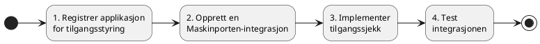
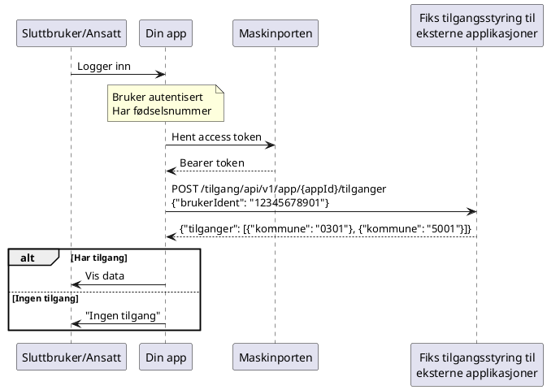

# Kom i gang som applikasjonstilbyder

Denne veiledningen er for deg som utvikler en applikasjon og ønsker å bruke Fiks tilgangsstyring til eksterne applikasjoner som autorisasjonstjeneste.

Tjenesten brukes til å avgjøre om en bruker har tilgang til data for én eller flere kommuner, mens applikasjonen selv driftes og forvaltes i ditt eget miljø.

> **Merk:** Tilgang vurderes i dag per kommunenummer.  
> Støtte for andre organisasjonsidentifikatorer (organisasjonsnummer eller tenant-id/FiksOrgId) er planlagt.

## Forutsetninger

- Dere har en organisasjon registrert i Fiks-plattformen og har en avtale på at dere kan være tilbyder
- En applikasjon som kjører i deres eget miljø
- Administrator-tilgang til Fiks-plattformen
- Maskinporten-klient opprettet i Samarbeidsportalen

## Oversikt

## 1. Registrer applikasjonen

### Via Fiks forvaltning

1. Logg inn på Fiks forvaltning med ID-porten
2. Naviger til **Fiks tilgangsstyring til eksterne applikasjoner**
3. Velg **Registrer ny applikasjon**
4. Fyll ut:
   - Applikasjonsnavn
   - Beskrivelse
   - URL til applikasjonen
   - Logo
5. Klikk **Opprett**

Du får tilbake en **App-ID (UUID)** som brukes i API-kall.

### Via API

Se [Leverandør API dokumentasjon](https://developers.fiks.ks.no/api/?spec=https://developers.fiks.ks.no/api/leverandor-tjenester-api-v1.json)

## 2. Knytt Maskinporten-integrasjon

Applikasjonen må kunne autentisere seg maskin-til-maskin ved tilgangssjekk.

Dette gjøres ved å opprette en Maskinporten-integrasjon i Samarbeidsportalen (Digdir)

Detaljer om oppsett av Maskinporten er beskrevet i
[Digdirs dokumentasjon](https://docs.digdir.no/maskinporten_guide_apikonsument.html).

## 3. Implementer tilgangssjekk

### API-endepunkt

**Produksjon:** `https://api.fiks.ks.no`
**Test:** `https://api.fiks.test.ks.no`

### Flyt ved brukerinnlogging

