## Kort beskrivelse
Fiks SMS er en felleskomponent som brukes i flere av Fiks tjenestene. En typisk oppgave for Fiks SMS komponeneten er utsendelse av tekstmelding til innbyggere i kommunen som har til formål å få innbygger til å utføre en handling. Dette kan være alt fra informasjon om at byggesaken er ferdig til å varsle om flom eller nedetid for vanntjenester.

## Bruk av Fiks SMS

### Steg 1 
Fiks melding tjenesten må tas i bruk. Les mer om avtaler og å ta i bruk tjenester [her](https://portal.fiks.ks.no/fiks/avtalen/).

### Steg 2

Deretter må det opprettes en konto det skal sendes SMS med. Dette gjøres inne på Fiks Konfigurasjon grensesnittet ved å finne kortet
for Fiks Melding.
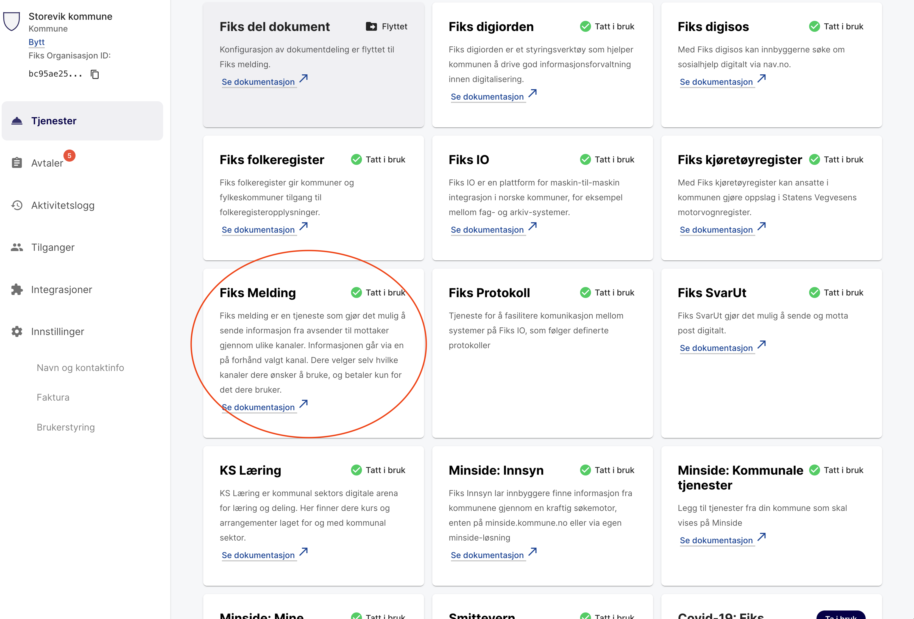
Klikk så videre på "Konfigurer SMS-kontoer".
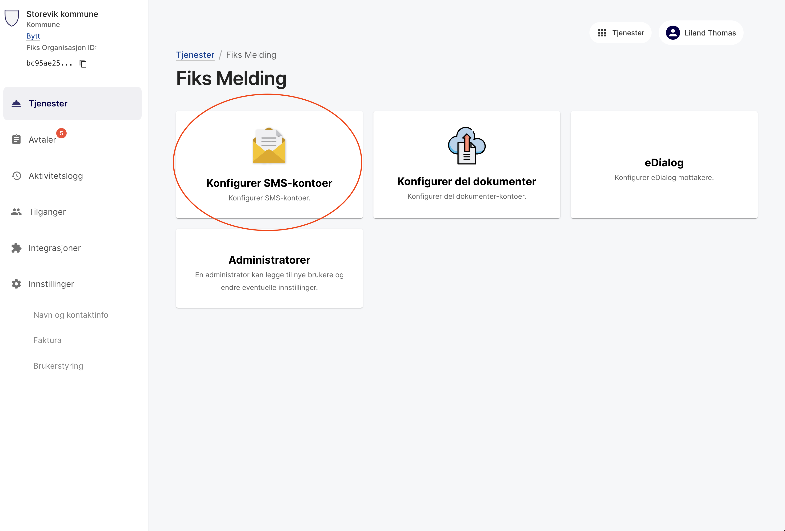
Merk at for å opprette en konto må man være tjenesteadministrator (en administrator for organisasjonen eller en som har blitt tildelt administrator på Fiks melding).

Klikk på "Opprett Konto".


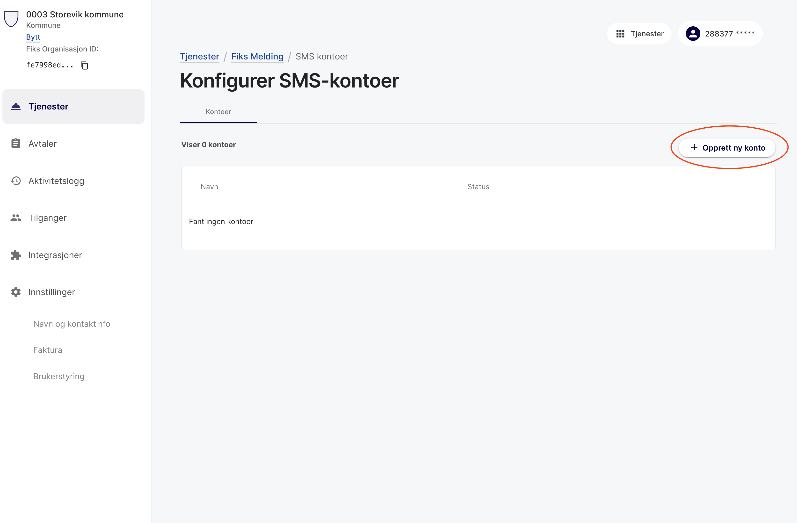

Fyll inn feltene som vist på bildet. 

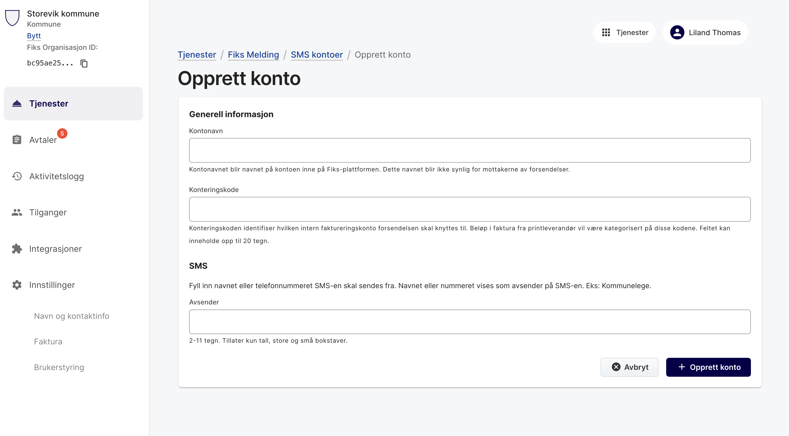

### Steg 3

Etter at en konto er opprettet må det legges til en eller flere brukere på kontoen. 

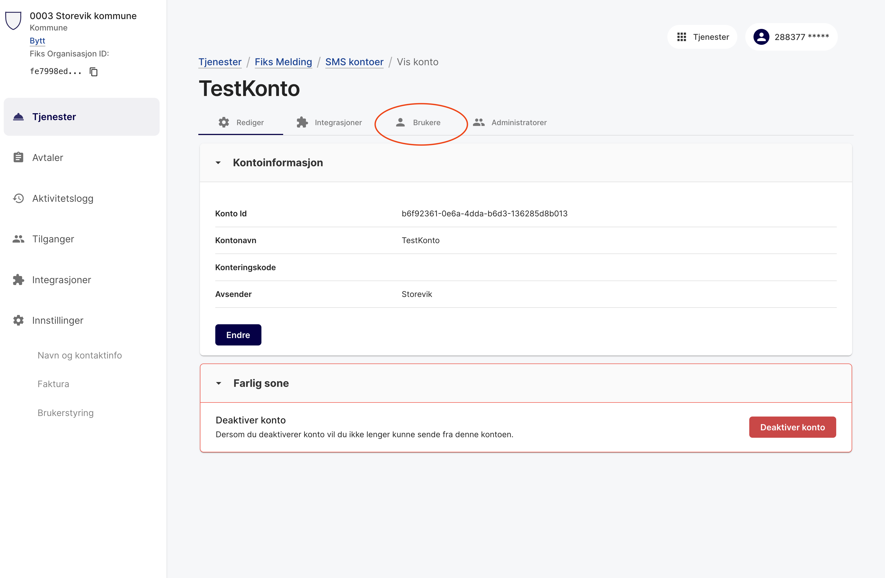

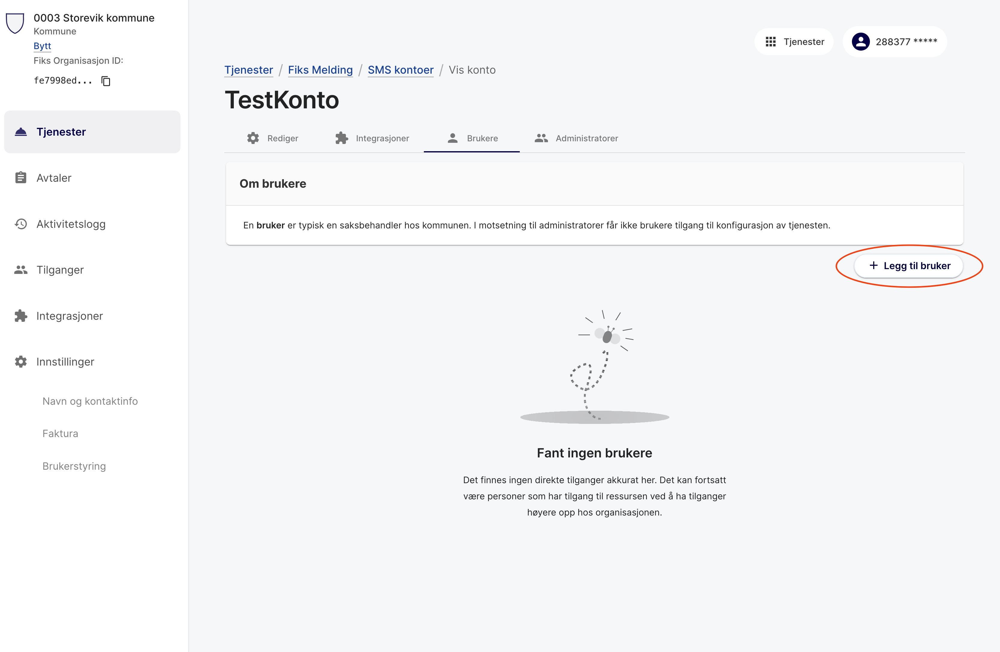

### Steg 4

For å sende SMS med kontoen velger man følgende kort i Fiks Forvaltning grensesnittet og så kontoen man har blitt tildelt tilgang på.

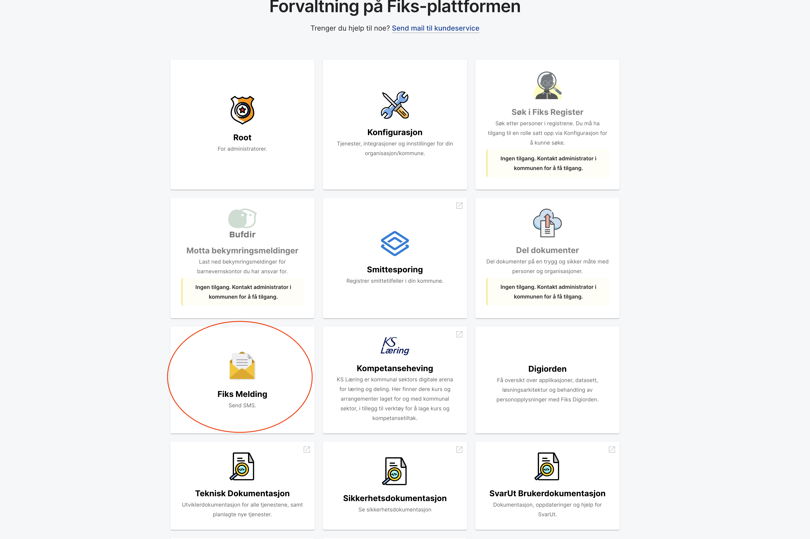

Så kan man opprette en ny utsendelse

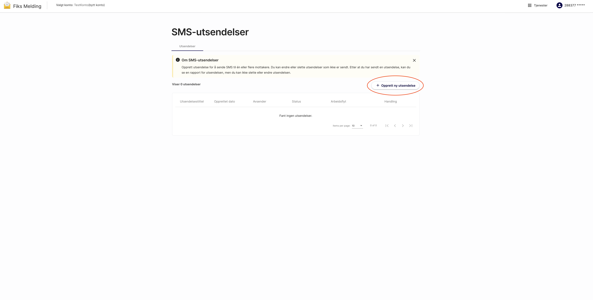

For å legge til mottakere kan det lastes opp et excel ark eller så kan de legges til manuelt. 

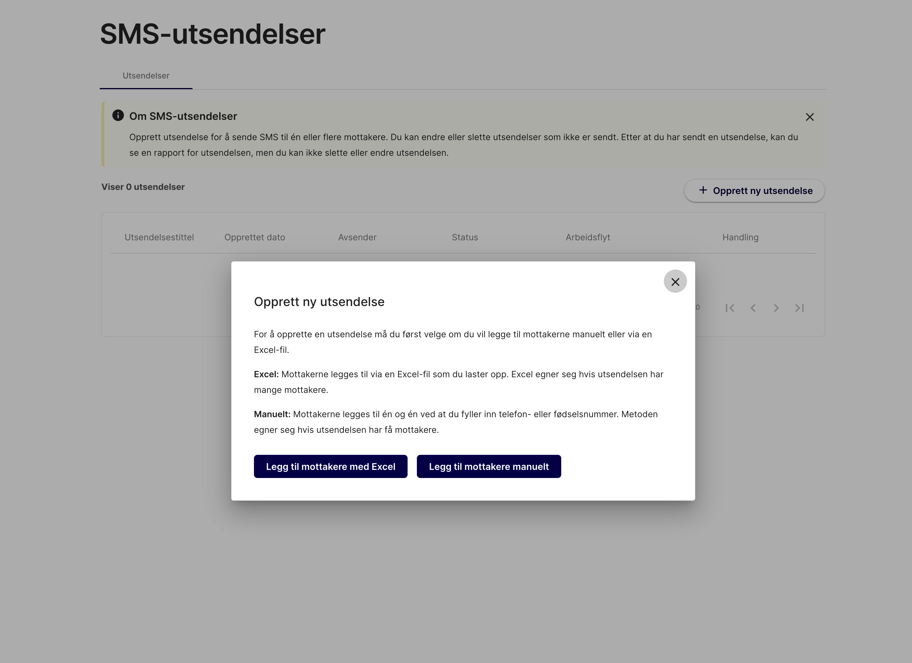

Alle mottakere må ha gyldig telefonnummer gitt enten 
fra bruker eller gjennom oppslag på fødselsnummer mot Kontakt- og reservasjonsregisteret før utsendelsen kan sendes.  

## Bruk av Fiks SMS gjennom API

For å sende SMS via API må en SMS konto opprettes som over, men det må lages en integrasjon (les mer om integrasjoner [her](https://developers.fiks.ks.no/felles/integrasjoner/)) på kontoen. 

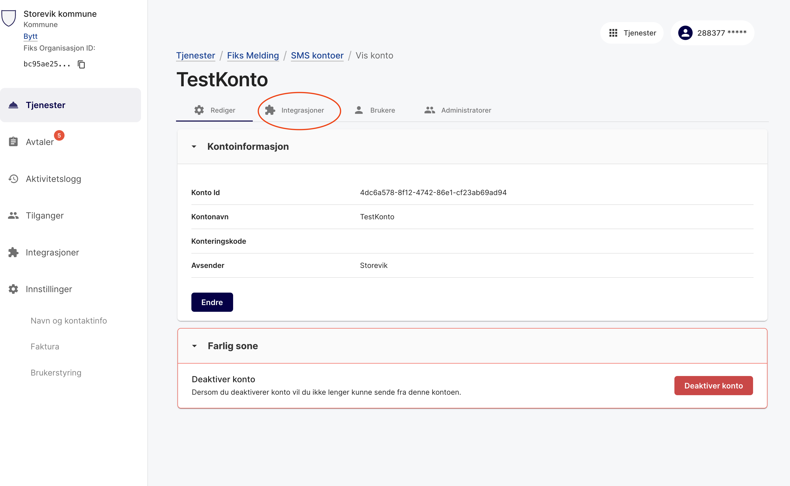


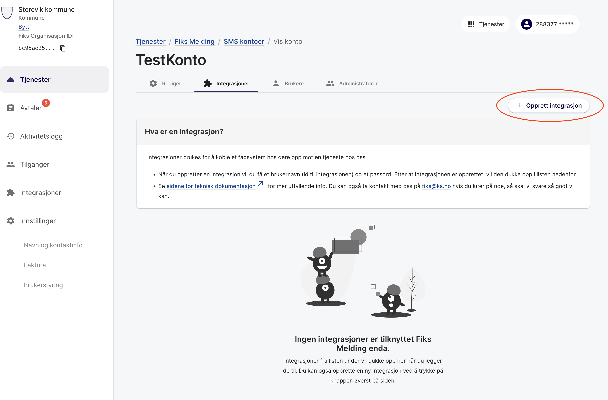

Når man har vært gjennom wizarden for opprettelse av integrasjon må den gis tilgang, og så skal denne brukes for kall til APIet definert i https://editor.swagger.io/?url=https://developers.fiks.ks.no/api/varsling-sms-api-v2.json

For å sende enkel SMS: `POST /varsling/api/v2/sms/{kontoId}/send`

```json
{
  "tekst": "string",
  "fnr": "08956609002",
  "telefonnummer": "string"
}
```

For å sende batch SMS på opptil 1000 mottakere: `POST /varsling/api/v2/sms/{kontoId}/sendBatch`

```json
{
  "telefonnummere": [
    "string"
  ],
  "tekst": "string"
}
```

For å gjøre oppslag i Kontakt- og reservasjonsregisteret på opp til 1000 fødselsnummer: `POST /varsling/api/v2/sms/{kontoId}/oppslag`

```json 
[
  {
    "fnrOrgnr": "string",
    "telefonnummer": "string",
    "telefonnummerStatus": "GYLDIG"
  }
]
```


