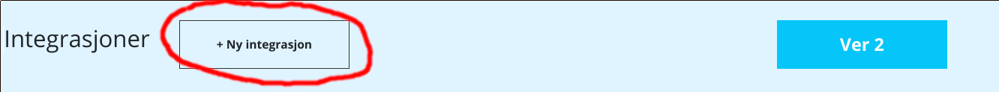

---
title: Hvordan lage klient hos idporten
date: 2019-09-19
---

- Du må ha maskinporten/openid connect konto hos idporten i ver2 miljøet. (Dere må ha virksomhetsertifikat for test fra Commfides eller Buypass)
- Gå til https://selvbetjening-samarbeid.difi.no/#/
- logg inn
- velg gå til ingegrasjoner, for ver2 for test. Produksjon for prod.
 
- velge ny integrsjon
 
- Sett Integrasjon for: for egen virksomhet -> integrasjonstype = maskinporten,  -> velg scopes,  Der skal du sjå ks:fiks i lista.
- client_name: til et navn som passer
- Difi-tjeneste: Maskinporten (for person innlogging må du kontakte idporten@difi.no)
- legg til scopes: ks:fiks ( Vises ikke dette har vi ikke fått korrekt orgnr fra dere, send det til fiks-utvikling@ks.no)
- grant_types: urn:ietf:params:oauth:grant-type:jwt-bearer må være valgt
- token_endpoint_auth_method: private_key_jwt 

- lagre -> Da får du client_id.

- Hvis du skal ha person innlogging med ks:fiks scope må du sende en henvendelse til idporten@difi.no
- For produksjon må ein følge rutina her: https://samarbeid.difi.no/felleslosninger/maskinporten/ta-i-bruk-maskinporten/1-planlegge-og-akseptere-bruksvilkar
