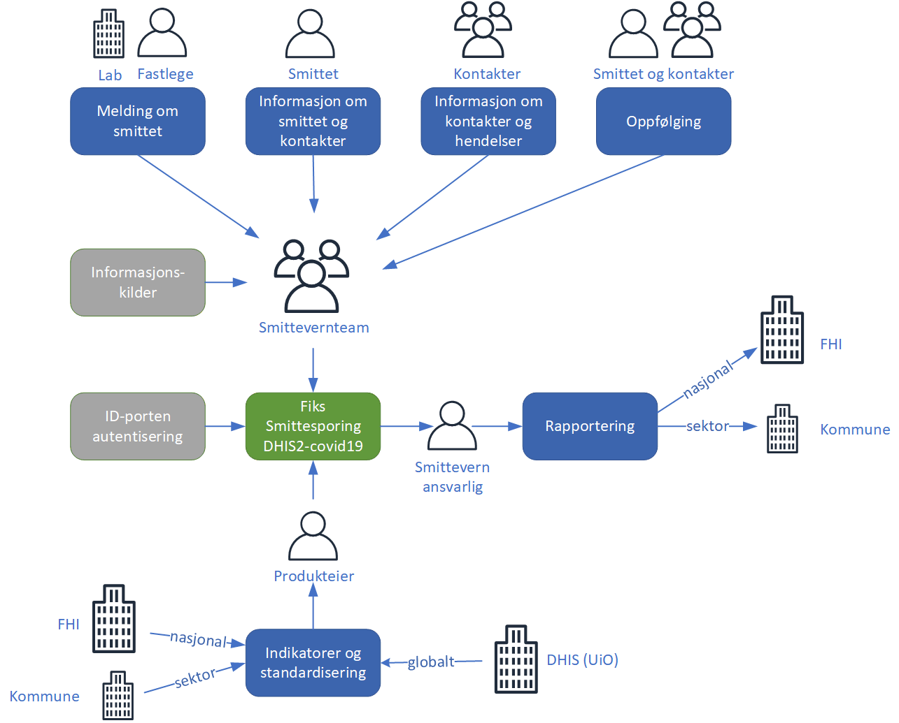

### Bakgrunn
I en pandemi som covid-19 er smitteoppsporing eller smittesporing et viktig arbeid som er lovfestet gjennom smittevernloven. Lege som har mistanke om smittsom sykdom, skal foreta smittesporing. I praksis har kommunelegen dette ansvaret og oppretter smittsporingsteam i sin kommune. Arbeidet med smittesporing er i dag manuelt og basert på bruk av penn og papir eller kontorstøtteverktøy som Excel.

KS vil i løpet av mai lansere en tjeneste under Fiks-plattformen som tilbyr kommunene et felles digitalt verktøy for smittesporing. Verktøyet kan benyttes uavhengig av størrelsen på kommunen og antall bekreftede covid-19 tilfeller. Felles verktøy er viktig slik at kartlegging av hvor smitte foregår i samfunnet blir samlet inn, systematisert og delt nasjonalt. Ved distribusjon gjennom Fiks-plattformen og et standard oppsett av data som skal samles inn, er det enkelt for kommunene å ta i bruk verktøyet. Tjenesten baserer seg på verktøyet DHIS2.

DHIS2 (District Health Information Software 2) er et verktøy for innsamling, validering, analyse og presentasjon av samlede og personbaserte statistiske data. DHIS2 er en modulbasert programvarepakke bygget med gratis og åpen kildekode Java-rammer. DHIS2 har utviklet en spesialisert modul for smittesporingrundt covid-19 pandemien. DHIS2 er utviklet av Universitetet i Oslo og er tatt i bruk i en rekke land.

For mere informasjon om DHIS2 covid-19 se https://www.dhis2.org/covid-19
### Fiks Smittesporing

Systemet har en felles installasjon for alle kommunene og leveres som en skytjeneste. Dette gir en felles forståelse av informasjonen i systemet og effektiviserer rapporteringen i kommunene og til FHI. Rapportering om smittesporing fra kommunene er et viktig verktøy for å vurdere nasjonale smittereduserende tiltak og effekten av disse. En felles skytjeneste forenkler det å ta i bruk løsningen og nye versjoner.

Figuren under beskriver de overordnede prosessene som inngår i tjenesten Smittsporing.

Funksjonaliteten i DHIS2 er kort fortalt registrering av informasjon om smittet og hvem den smittede har vært i kontakt med, kalt nærkontakter. Innsamling av informasjon som skal registreres, skjer ved intervju. En nærkontakt er definert etter regler gitt av FHI. Ved innsamling av informasjon kan ansatte bruke andre kilder som folkeregisteret, karttjenester, arrangementinformasjon, etc.

I tillegg til smittet og nærkontakter kan det registreres hendelser som er en samling av mange personer, hvor smittet og nærkontakter har deltatt. Eksempler på hendelser kan være konserter, samlinger, sykehjem, barnehage, etc.

Smittet og nærkontakter følges opp med tiltak og oppfølging parallelt med rapportering til kommunene og FHI.

Konfigurasjonen av DHIS2 covid-19 for kommunene består av skjema og indikatorer utarbeides i samarbeid mellom kommunene og FHI. Produkteier i KS koordinerer dette arbeidet.
#### Organisasjon
DHIS2 er et fellessystem hvor øverste organisasjonsenhet er Norge. Landet er videre delt opp i fylkeskommuner og kommuner. På denne måten kan det lages rapporter pr. kommune som aggregeres opp til en nasjonal oversikt. Dette er en viktig egenskap ved tjenesten da oppfølging og ansvar for covid-19 smitte og -tiltak ligges hos FHI.

Register over Kommuner og fylkeskommuner er registert med kommunenummer i henhold til Kartverkets kommuneregister. Dette kan ikke endres, men det kan legges til organisatoriske enheter innenfor hver kommune. Dette kan være bydel som de største kommunene benytter.
#### Nasjonale felleskomponenter
Id-porten benyttes for autentisering av personer som bruker løsningen.
### Forutsetning for bruk
Forutsetning for ta i bruk DHIS2 er at det finnes en SSA-L avtalen mellom KS og kommunen om bruk av Fiks-plattformen i kommunen. Det er en egen avtale for bruk av DHIS2 med covid-19 modul som er et tjenestevedlegg til SSA-L. Tjenestevedlegget inneholder databehandleravtale mm.

Når avtaler er på plass setter kommunen selv opp tilgang til løsningen ved at administrator registrere brukere med roller. Tilgang (auturisasjon) gis på kommunenivå.
