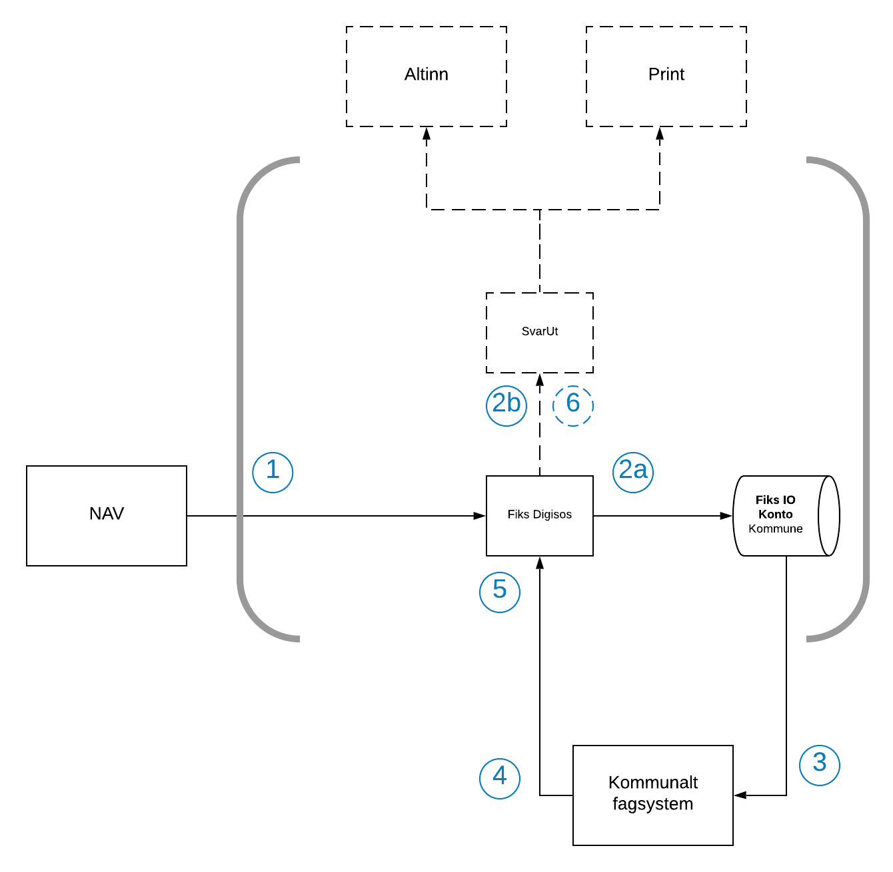

# Kort beskrivelse
Fiks Digisos er en tjeneste for å tilrettelegge for kommunal behandling av sosialsøknader via et brukergrensesnitt på Forside privatperson - nav.no . 

Fiks Digisos tilbyr: 
- Enkelt oppsett for den enkelte kommune gjennom Fiks Konfigurasjon. 
- Innbygger får fortløpende oppdatering på saksgang, tilgjengelig på Forside privatperson - nav.no . 
- Innbygger får tilgang til alle dokumenter og mulighet til å sende inn nye søknader basert på data fra tidligere søknader. 
- Ansatte/brukerstøtte i NAV kan se utvalgte deler av saken via NAV sine systemer. 
 

# Tilgjengelige grensesnitt

|**Grensesnitt**|**Støtte**|
|---------------|----------|
| Web portal | Ja |
| Maskin til maskin | Ja |

# Beskrivelse av tjenesten

## Detaljert teknisk oversiktsskisse

## Detaljert teknisk beskrivelse av løsning og integrasjon
Digisos består av flere komponenter fra Fiks-plattformen, der Fiks Digisos er hovedkomponenten som bruker andre komponenter:

- Fiks Digisos API: API for innsending av søknader fra nav.no og innsending av saksoppdateriger fra kommunenes fagsystemer.
- Fiks Dokumentlager: Brukes for lagring av krypterte søknader og saksoppdateringer, der innbyggeren får tilgang til sine dokumenter sendt over Digisos API-et.
- Fiks IO: Brukes som leveringskanal for søknader fra NAV til kommunene, som er en sikker kanal for maskin-til-maskin integrasjon, hvor søknadene blir meldingskryptert med mottakers offentlige nøkkel.
- SvarUt/SvarInn: Brukes som en alternativ leveringskanal for søknader fra NAV til kommunene, med leveranse med print dersom kommunens fagsystem ikke klarer å motta digitale forsendelser via SvarInn.

### Flyt
1) Innbygger fyller ut søknad om sosialstønad på nav.no, som sender denne til Fiks Digisos gjennom et synkront http api.
2) Fiks Digisos mottar søknaden.
    a) Søknadsfilen legges i Fiks Dokumentlager, og innbyggeren autoriseres for tilgang.
    b) Fiks Digisos henter valgt leveransekanal for søknaden fra kommunens konfigurasjon, enten anbefalt kanal 2a) Fiks IO med SvarUt som alternativ eller 2b) Bare SvarUt.
        - Fiks IO - Kommunens konfigurasjon inneholder en konto-id som blir brukt som mottaker. Digisos-meldingene vil bli validert før de sendes til denne kontoen via Fiks IO. Den vil være tilgjengelig for henting fra Fiks IO-køen i en fastsatt periode. Dersom den oppgitte kontoen ikke støtter digisos-meldinger eller om kommunen ikke bekrefter mottak før denne perioden går ut vil meldingen bli trukket og alternativ kanal SvarUt benyttes for levering av søknaden (se punkt 5).
        - SvarUt/SvarInn - Søknaden sendes til SvarUt til kommunenes SvarInn mottakersystem, enten fordi den er valgt som eneste leveransekanal, eller fordi kommunen ikke kan motta digisos-meldinger gjennom Fiks IO (se punkt 5).
    c) Fiks returnerer 202 ACCEPTED på http-kallet fra NAV. Dette markerer ansvarsoverføring fra NAV til Fiks, som fra nå garanterer at saken leveres til kommune for behandling.
3) Søknanden opprettes i kommunalt fagsystem etter vellykket mottak via Fiks IO eller SvarInn.
4) Det kommunale fagsystemet bekrefter mottak av søknaden og oppdaterer status i Fiks Digisos.
    a)Evt. nye filer legges til saken, autorisert for innbygger.
    b) Saken er tilgjengelig for innbygger på nav.no.
5) Om fagsystemet avviser eller unnlater å bekrefte mottak av saken via Fiks IO vil SvarUt benyttes som alternativ kanal, der det inkluderes en fil som inneholder både NAV og Fiks Digisos sin id for saken. I praksis betyr dette at meldingen blir sendt til kommunens SvarInn mottakersystem, evt. sendt til print og postlagt ved problemer med mottak til kommunens fagsystem.
6) Søknader mottatt via SvarUt kan også manuelt lastes ned av kommunen via SvarUt-brukergrensesnittet.

### Integrasjonsutvikling fagsystem
Det anbefales å lese gjennom dokumentasjonen for generell [integrasjonsutvikling mot Fiks](https://developers.fiks.ks.no/fiks-plattform/integrasjoner/), der siste avsnitt, “Hvordan komme i gang med utvikling”, er svært nyttig. På denne siden beskrives blant annet oppsett av IDPorten og autentisering mot Fiks, der fagsystemet bruker Integrasjon som autentiseringsmetode. Fiks tilbyr både en [Java-klient](https://github.com/ks-no/fiks-maskinporten) og en [.net-klient](https://github.com/ks-no/fiks-maskinporten-client-dotnet) som kan brukes for å generere access token fra Maskinporten (IDPorten). Avsnittet [Konfigurasjon](https://ks-no.github.io/fiks-plattform/integrasjoner/#konfigurasjon) beskriver hvordan en integrasjon opprettes og tilknyttes en tjeneste (Digisos). Integrasjons-id-en og passordet generert her må dermed brukes sammen med access token fra Maskinporten for å få tilgang til Digisos-API-et.

#### Mottak av søknader 
Fagsystemet kan motta søknader enten via Fiks IO eller SvarInn/SvarUt. I tillegg til søknadsfilene sendt fra NAV, vil det inkluderes en ekstra json-fil med metadata. Denne metadataen vil være forskjellig basert på om det er en søknad eller ettersendelse som er sendt fra NAV. I begge tilfellene vil den inneholde en Fiks DigisosId for å kunne sende saksoppdateringer til Fiks Digisos API og en unik referanse fra NAV, eksternRef. For ettersendelser vil den i tillegg inneholde informasjon om hvilken søknad ettersendelsen tilhører, og om selve søknaden ble sendt over Fiks IO eller SvarUt.

Søknad: Eksempel på innholdet i metadata-file for søknader er definert i [søknad-metadata-eksempel](https://github.com/ks-no/fiks-io-meldingstype-katalog/blob/prod/schema/no.nav.digisos.soknad.v1/examples/litenDigisosMelding.json).
Ettersendelse: Eksempel på innholdet i metadata-file for ettersendelser er definert i [ettersendelse-metadata-eksempel](https://github.com/ks-no/fiks-io-meldingstype-katalog/blob/prod/schema/no.nav.digisos.ettersendelse.v1/examples/litenDigisosMelding.json).

Selve data-feltene i metadata-filen vil være definert likt for både Fiks IO og SvarUt. Følgende er spesifikt for de ulike leveringskanalene:

** Fiks IO **
Ved bruk av Fiks IO som leveringskanal må fagsystemet støtte meldingsprotokollen no.nav.digisos.fagsystem.v1, som er definert for bruk av Digisos-meldinger, som inneholder kontrakter i form av json-schema som gjelder både for mottak og svar på Fiks IO meldinger. Fagsystemet må derfor støtte meldingstypene for denne protokollen, for mottak og sending av meldinger for både søknader og ettersendelser:

* Til fagsystem - mottak av søknad og ettersendelse *
Dette er de samme metadataene som blir beskrevet ovenfor.
For ny søknad, no.nav.digisos.soknad.v1, som definert i [json-skjema for søknad](https://github.com/ks-no/fiks-io-meldingstype-katalog/tree/prod/schema/no.nav.digisos.soknad.v1).
For ettersendelse, no.nav.digisos.ettersendelse.v1, som definert i [json-skjema for ettersendelse](https://github.com/ks-no/fiks-io-meldingstype-katalog/blob/prod/schema/no.nav.digisos.ettersendelse.v1/examples/litenDigisosMelding.json).

* Fra fagsystem - kvittering på mottatt søknad og ettersendelse *
For ny søknad, no.nav.digisos.soknad.mottatt.v1, med tom body.
For ettersendelse, no.nav.digisos.ettersendelse.mottatt.v1, med tom body.

For mer informasjon om Fiks IO, se [dokumentasjon for Fiks IO](https://ks-no.github.io/fiks-plattform/tjenester/fiksprotokoll/fiksio/).

** SvarInn/SvarUt **
Ved bruk av SvarUt som leveringskanal må fagsystemet støtte mottak av metadata-filen som definert ovenfor, [Mottak av søknader](https://ks-no.github.io/fiks-plattform/tjenester/digisos/#mottak-av-s%C3%B8knader). Denne metadata filen vil være lagt med selve SvarUt forsendelsen, kalt forsendelseMetadata.json.
Søknad: Eksempel på innholdet i forsendelseMetadata.json for søknader er definert i [søknad-metadata-eksempel](https://github.com/ks-no/fiks-io-meldingstype-katalog/blob/prod/schema/no.nav.digisos.soknad.v1/examples/litenDigisosMelding.json).
Ettersendelse: Eksempel på innholdet i forsendelseMetadata.json for ettersendelser er definert i [ettersendelse-metadata-eksempel](https://github.com/ks-no/fiks-io-meldingstype-katalog/blob/prod/schema/no.nav.digisos.ettersendelse.v1/examples/litenDigisosMelding.json).

Eksempel på mottak av søknad med tilhørende ettersendelse
Mottak av søknad med tilhørende fil forsendelseMetadata.json:

/{
    "eksternRef": "110004PCC",
    "digisosId": "3fa85f64-5717-4562-b3fc-2c963f66afa6"
/}

### Fagsystem???

# Hvordan ta i bruk
1. Sjekk at kommunens fagsystem er kompatibelt med Digisos. 
2. Ta kontakt med fiks[at]ks.no for en tilgang til testmiljøet. 
3. Kommunens tjenesteadministrator oppretter en integrasjon på Fiks forvaltning portalen. 
4. Test og verifiser test integrasjonen. 
5. Skriv avtale med KS på tjenesten. 
6. Kommunens tjenesteadministrator oppretter en integrasjon på Fiks forvaltning portalen mot produksjonsdata. 
7. Verifiser at integrasjonen virker. 

# Integrerte fiks komponenter
- Fiks svarut/svarinn
- Fiks IO
- Fiks dokumentlager
- Digisos API

# Testmiljø
Send en e-post til fiks[at]ks.no for å få tilgang til testmiljøet.
Konfigurasjon finnes på [forvaltning.fiks.ks.no](https://forvaltning.fiks.test.ks.no) Benytt ID-porten testbruker for innlogging.
